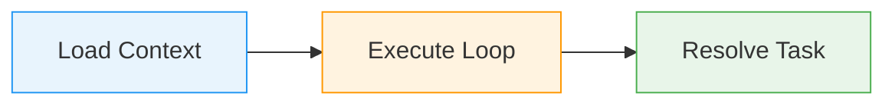
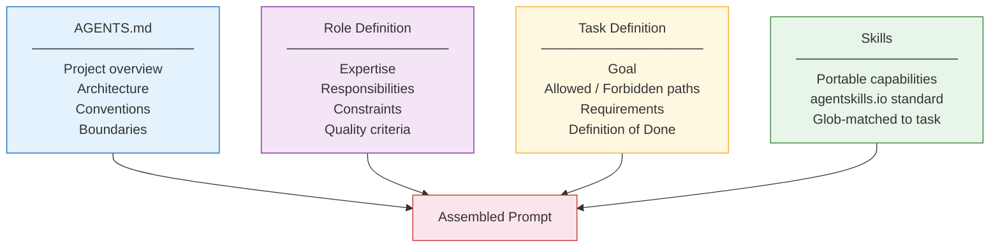
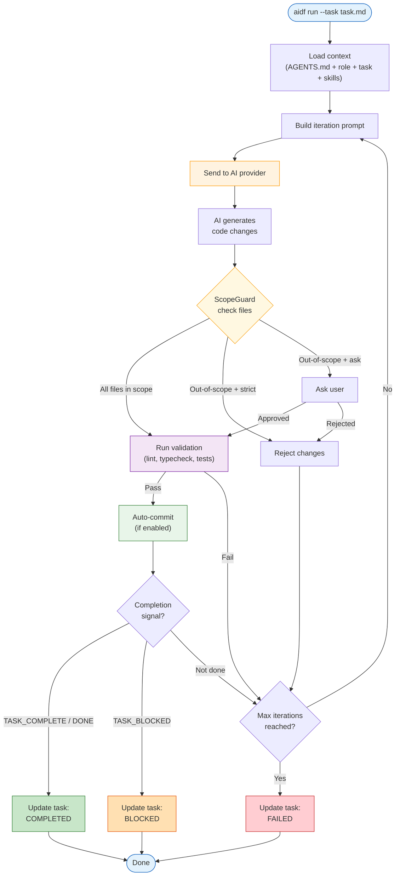
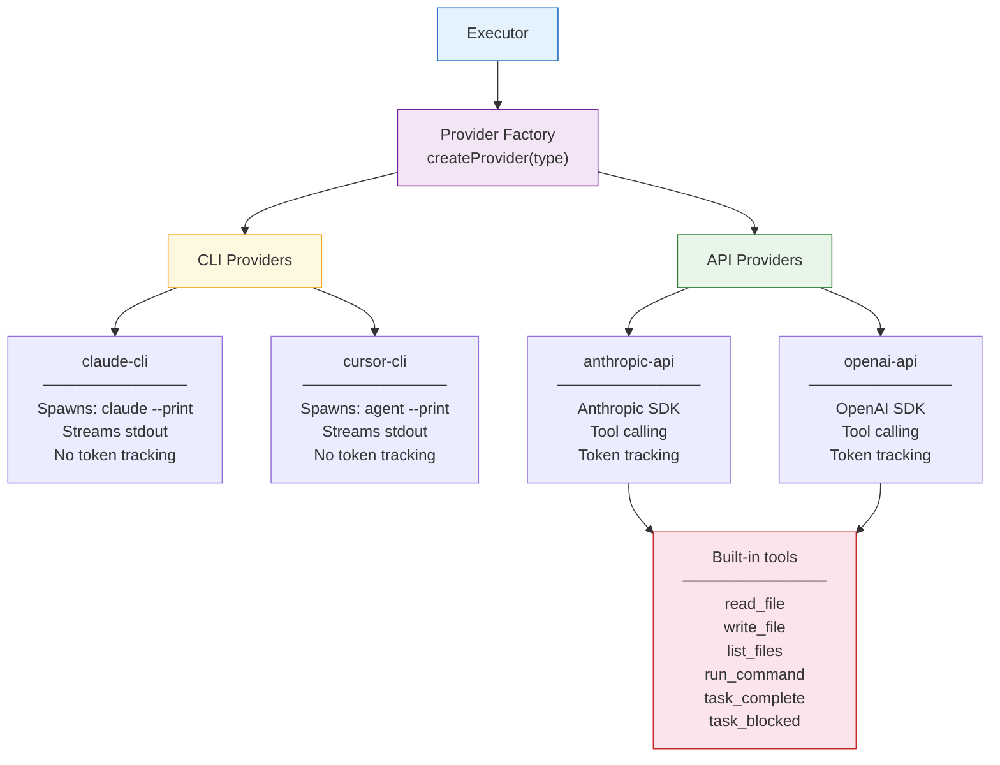
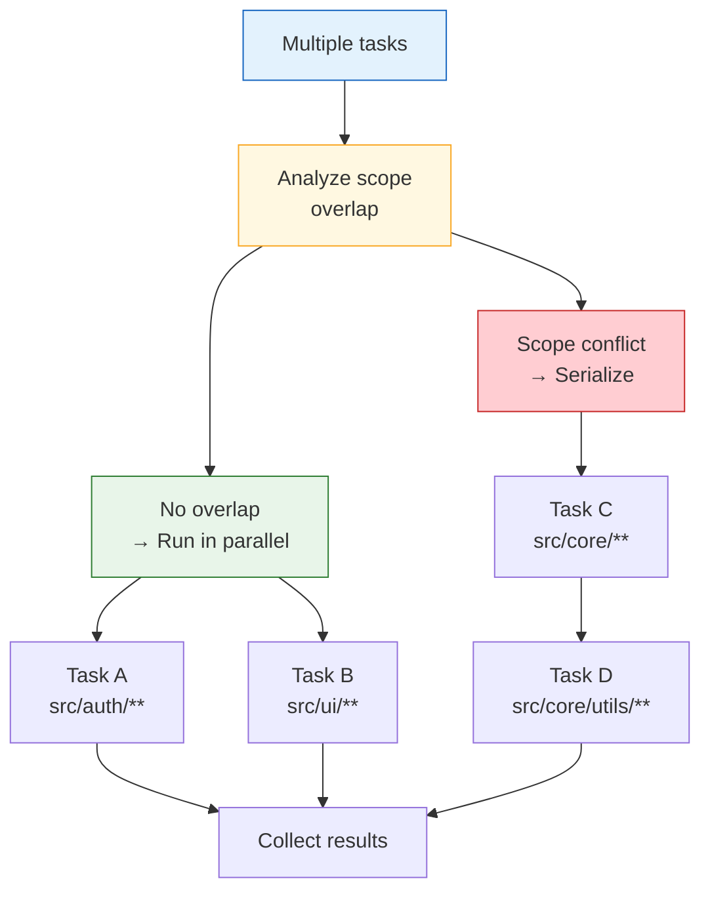
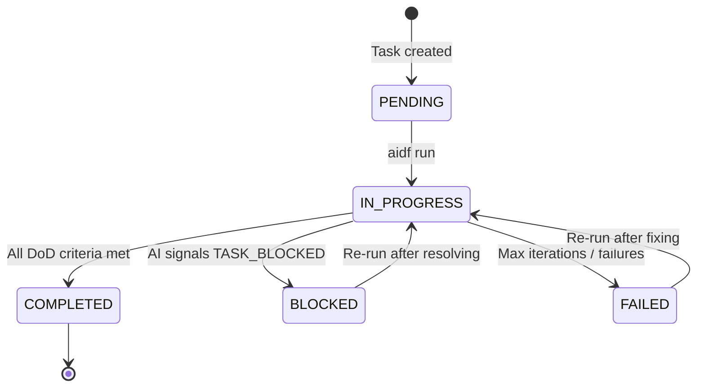

This page explains how an AI agent behaves when it uses AIDF — from context loading to task completion.

---

## High-Level Overview

An AIDF-powered agent operates in three phases: **context loading**, **iterative execution**, and **task resolution**.

---

## Context Composition

Before executing anything, the agent assembles a layered prompt from the `.ai/` folder. Each layer adds specificity:

The context is additive — you only need AGENTS.md at minimum. Roles, tasks, and skills are optional layers.

---

## Execution Loop

This is the core behavior. The executor (`core/executor.ts`) runs an iterative loop, where each iteration goes through prompt building, AI execution, scope checking, validation, and commit.

### Key decision points

- **ScopeGuard** — Validates every changed file against the task's allowed/forbidden paths. The behavior depends on the `scope_enforcement` mode (`strict`, `ask`, or `permissive`).
- **Validation** — Runs the commands listed in `config.yml` under `validation.pre_commit` (typically lint, typecheck).
- **Completion detection** — The AI signals it's done by outputting `<TASK_COMPLETE>` or `<DONE>`. If it can't proceed, it outputs `<TASK_BLOCKED>` with a reason.
- **Iteration limit** — Prevents runaway execution. Configurable via `execution.max_iterations`.

---

## Provider Architecture

AIDF supports four providers. They all implement the same interface (`execute(prompt, options)`) but work differently under the hood:

**CLI providers** delegate all file operations to the AI's own tooling (Claude Code or Cursor). The executor only sees the final output and file changes on disk.

**API providers** use tool calling — the AI requests file operations (read, write, list, run commands) through a structured tool interface defined in `providers/tool-handler.ts`.

---

## Parallel Execution

When running multiple tasks, the `ParallelExecutor` analyzes scope overlap to determine which tasks can run concurrently:

Tasks touching different files run simultaneously. Tasks with overlapping scopes run one after another to prevent conflicts.

---

## Task Lifecycle

A task file (`.ai/tasks/*.md`) goes through defined states:

The executor writes a `## Status` section to the task file with execution logs, files modified, and the final outcome.
