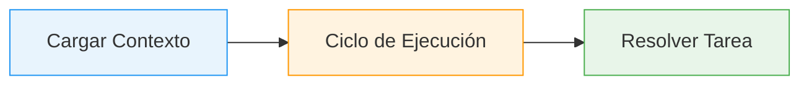
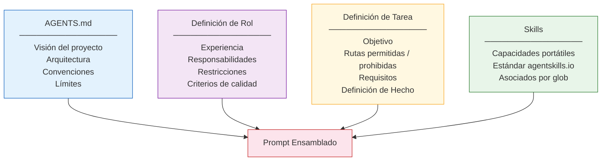
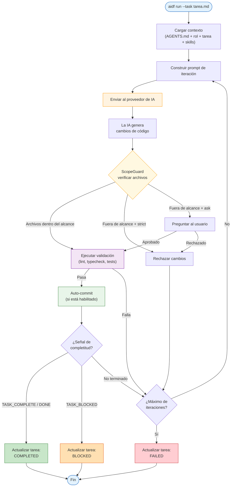
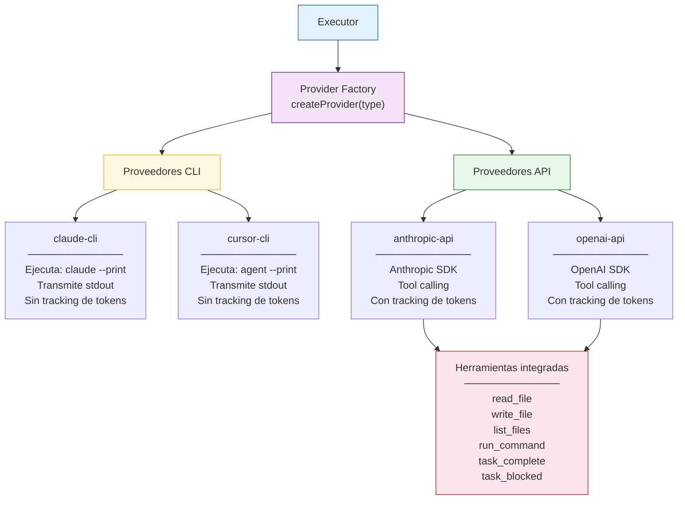
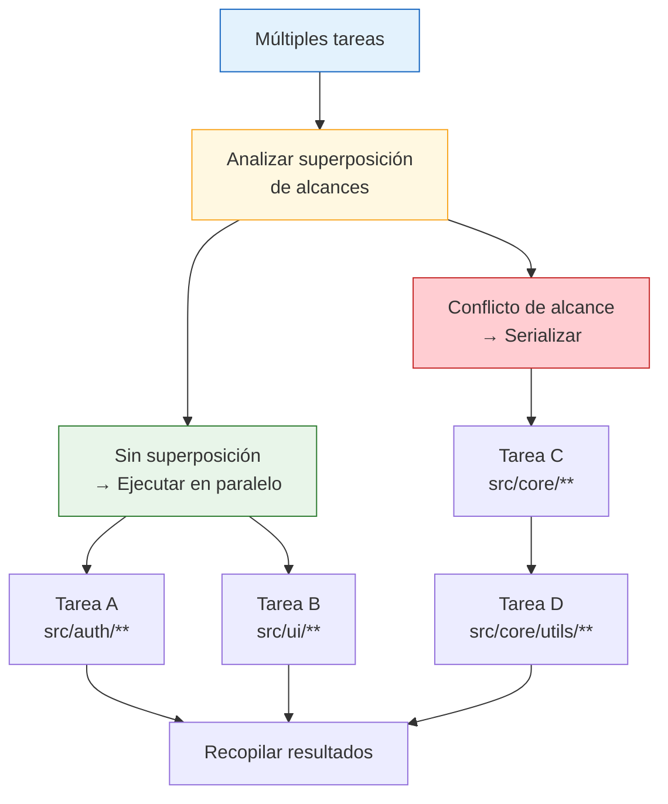
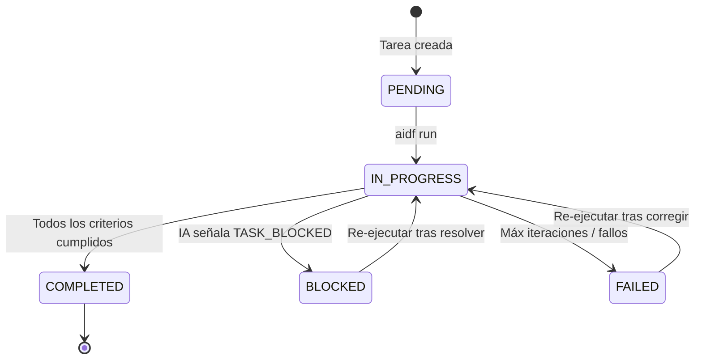

Esta página explica cómo se comporta un agente de IA cuando usa AIDF — desde la carga del contexto hasta la resolución de la tarea.

---

## Visión General

Un agente potenciado por AIDF opera en tres fases: **carga de contexto**, **ejecución iterativa** y **resolución de tarea**.

---

## Composición del Contexto

Antes de ejecutar cualquier cosa, el agente ensambla un prompt por capas desde la carpeta `.ai/`. Cada capa agrega especificidad:

El contexto es aditivo — solo necesitas AGENTS.md como mínimo. Los roles, tareas y skills son capas opcionales.

---

## Ciclo de Ejecución

Este es el comportamiento central. El executor (`core/executor.ts`) ejecuta un ciclo iterativo donde cada iteración pasa por la construcción del prompt, ejecución de la IA, verificación de alcance, validación y commit.

### Puntos de decisión clave

- **ScopeGuard** — Valida cada archivo modificado contra las rutas permitidas/prohibidas de la tarea. El comportamiento depende del modo `scope_enforcement` (`strict`, `ask` o `permissive`).
- **Validación** — Ejecuta los comandos listados en `config.yml` bajo `validation.pre_commit` (típicamente lint, typecheck).
- **Detección de completitud** — La IA señala que terminó emitiendo `<TASK_COMPLETE>` o `<DONE>`. Si no puede continuar, emite `<TASK_BLOCKED>` con una razón.
- **Límite de iteraciones** — Previene ejecuciones desbocadas. Configurable vía `execution.max_iterations`.

---

## Arquitectura de Proveedores

AIDF soporta cuatro proveedores. Todos implementan la misma interfaz (`execute(prompt, options)`) pero funcionan de forma diferente internamente:

**Los proveedores CLI** delegan todas las operaciones de archivos al tooling propio de la IA (Claude Code o Cursor). El executor solo ve el output final y los cambios de archivos en disco.

**Los proveedores API** usan tool calling — la IA solicita operaciones de archivos (leer, escribir, listar, ejecutar comandos) a través de una interfaz estructurada de herramientas definida en `providers/tool-handler.ts`.

---

## Ejecución Paralela

Al ejecutar múltiples tareas, el `ParallelExecutor` analiza la superposición de alcances para determinar cuáles pueden ejecutarse concurrentemente:

Las tareas que tocan archivos diferentes se ejecutan simultáneamente. Las tareas con alcances superpuestos se ejecutan una tras otra para evitar conflictos.

---

## Ciclo de Vida de una Tarea

Un archivo de tarea (`.ai/tasks/*.md`) pasa por estados definidos:

El executor escribe una sección `## Status` en el archivo de tarea con logs de ejecución, archivos modificados y el resultado final.
